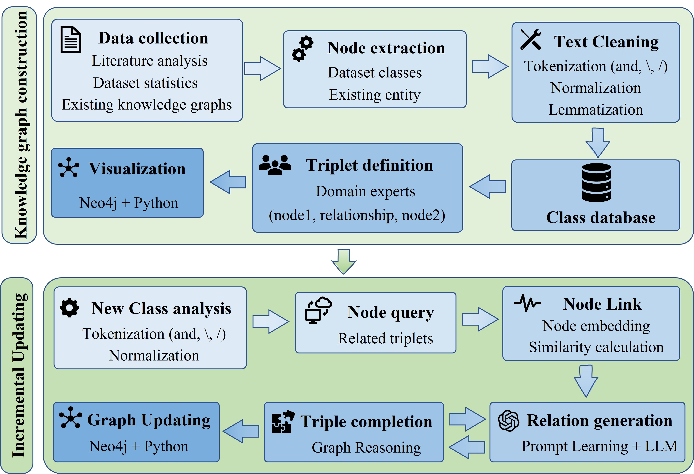
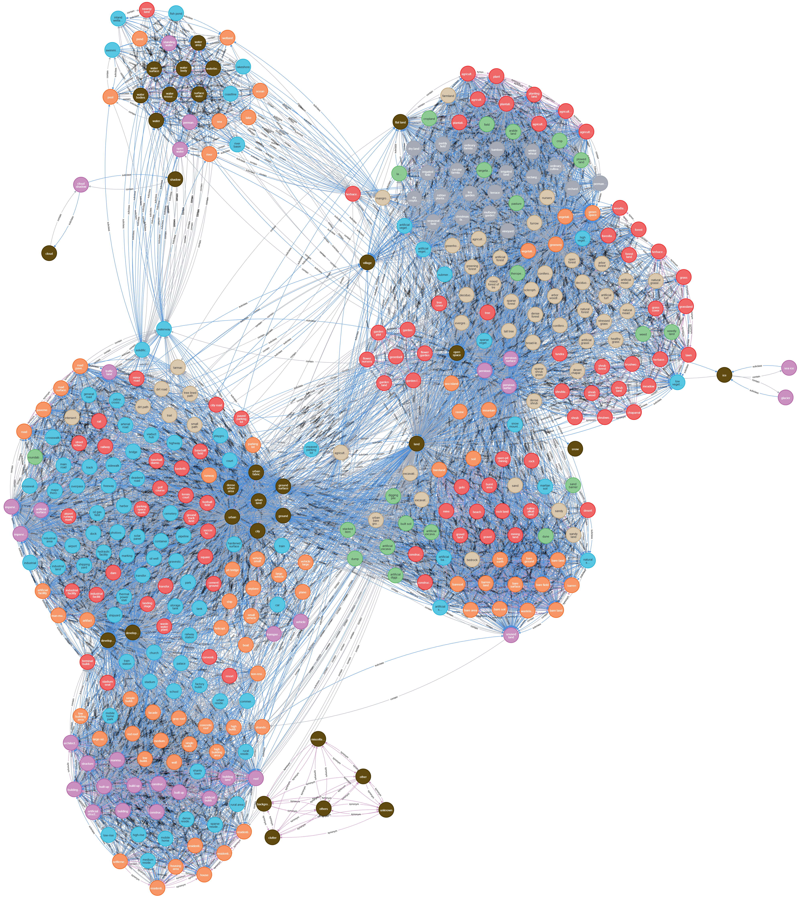
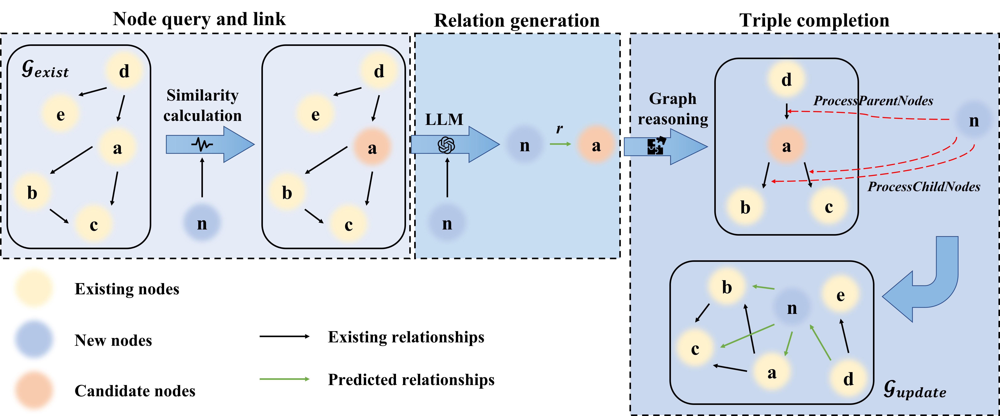

<h1>Land Cover Concept Knowledge Graph and Efficient Relationship Learning with Graph Reasoning for Incremental Knowledge Graph Updating</h1>

    <h3><strong>LCCKG & ERLG-Update</strong></h3>

    <strong>Wubiao Huang</strong>, Huchen Li, Haibing Liu, Zizhen Chen, Fei Deng*

    <h4 align="center">
        This repository is an official implementation of LCCKG & ERLG-Update
    </h4>

___________

> The paper is currently under review. The source code, pretrained resources, and documentation will be released immediately after paper acceptance.

---

# Overview

This repository presents **LCCKG**, the comprehensive **Land Cover Concept Knowledge Graph** for Earth observation, together with **ERLG-Update**, an efficient framework for incremental knowledge graph updating using Large Language Models (LLMs) and graph reasoning.

Unlike conventional knowledge graph completion methods that require model retraining or exhaustive pairwise prediction, ERLG-Update performs incremental graph expansion through three coordinated stages:

- **Entity Linking**
- **Relationship Generation**
- **Graph Reasoning**

The proposed framework achieves state-of-the-art accuracy while reducing LLM calls by over **99%** and completing graph updates within **824 seconds**, instead of several hours.

---

# Framework

The proposed ERLG-Update consists of three major stages:

---

# Land Cover Concept Knowledge Graph (LCCKG)

Download Link：[LCCKG](https://github.com/HuangWBill/LCCKG_ERLG-update/master/LCCKG.xlsx)

The proposed knowledge graph contains

| Item |                                       Statistics |
|------|-------------------------------------------------:|
| Land-cover concepts |                                          **383** |
| Knowledge triples |                                      **146,306** |
| Relation types | synonym / contain / subclass / different classes |
| Source papers |                                        **2,499** |
| Public datasets analyzed |                                          **127** |

The knowledge graph is constructed from large-scale remote sensing literature and publicly available benchmark datasets, providing standardized semantic relationships for land-cover concepts.

---

# ERLG-Update

Instead of predicting relationships between every pair of entities, ERLG-Update performs:

1. Candidate entity retrieval using semantic embeddings.
2. LLM-based relationship prediction.
3. Graph reasoning for automatic triple completion.

This significantly improves both efficiency and consistency during incremental graph updating.

---

# Supported LLMs

The framework has been evaluated using various large language models, including:

- DeepSeek-V3
- DeepSeek-R1
- GPT-4o
- Gemini 2.0
- Qwen2.5
- LLaMA3.3
- Gemma2
- Yi
- Vicuna
- LLaVA

Users can easily integrate other instruction-following LLMs.

---

# Benchmark Results

Compared with existing knowledge graph completion methods, ERLG-Update achieves:

- Higher prediction accuracy
- Fewer LLM calls
- Faster updating speed
- Better logical consistency

It completes the update of **75 unseen concepts** in only **824 seconds**, while requiring just **226 LLM calls**, substantially outperforming previous approaches.

---

# Downstream Applications

LCCKG can be directly applied to remote sensing Open-Vocabulary Semantic Segmentation (OVSS).

Replacing manually designed class prompts with LCCKG-generated semantic expansions consistently improves segmentation accuracy across multiple benchmark datasets, with average gains of approximately:

| Dataset | Average mIoU Improvement |
|----------|-------------------------:|
| Potsdam | +7.66% |
| FLAIR #1 | +6.23% |
| BLU | +8.12% |

---

# Acknowledgements

This project benefits from several excellent open-source projects and models, including:

- Neo4j
- Sentence-Transformers
- Ollama
- LLM

We sincerely thank the authors and developers for their outstanding contributions to the open-source community.

---
# Contact
If you have any questions regarding this work, please feel free to open an issue in this repository.

For academic inquiries, please contact:

Wubiao Huang

E-mail: huangwubiao@whu.edu.cn

---

⭐ **This repository will be continuously updated throughout the review process and after publication.**
